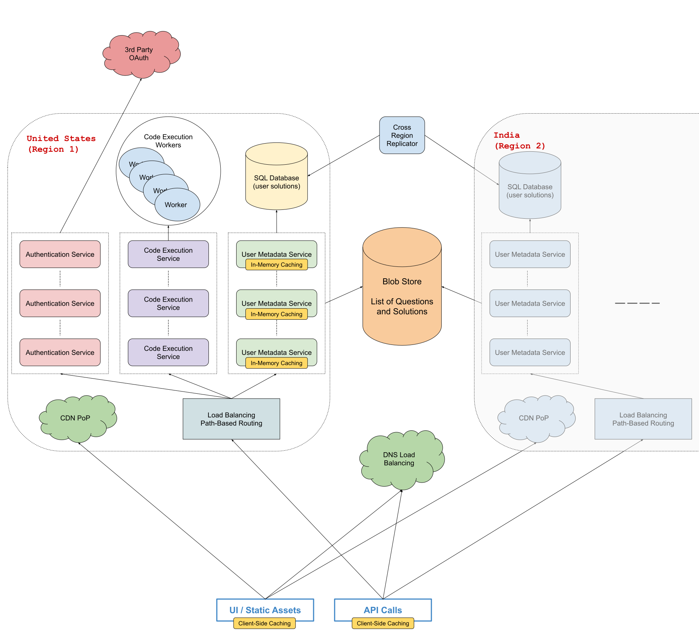

# Design AlgoExpert

Many systems design questions are intentionally left very vague and are literally given in the form of `Design Foobar`.\
It's your job to ask clarifying questions to better understand the system that you have to build.

We've laid out some of these questions below; their answers should give you some guidance on the problem.\
Before looking at them, we encourage you to take few minutes to think about what questions you'd ask in a real interview.

## Table of Content

- [Clarifying Questions](#clarifying-questions-to-ask)
- [Solution](#solution-walkthrough)

## Clarifying Questions To Ask

### Question 1

**Q:** *Are we designing the entire AlgoExpert platform or just a specific part of it, like the coding workspace?*

**A:**
Since we only have about 45 minutes, you should just design the core user flow of the AlgoExpert platform.\
The core user flow includes users landing on the home page of the website, going to the questions list, marking questions as complete or in progress, and then writing and running code in various languages for each language.\
Don't worry about payments or authentication; you can just assume that you have these services working already (by the way, we mainly rely on third-party services here, like Stripe, PayPal, and OAuth2).

### Question 2

**Q:** *AlgoExpert doesn't seem like a system of utmost criticality (like a hospital system or airplane software); are we okay with 2 to 3 nines of availability for the system?*

**A:** Yes, this seems — no need to focus too much on making the system highly available.

### Question 3

**Q:** *How many customers should we be building this for? Is AlgoExpert's audience global or limited to one country?*

**A:**
AlgoExpert’s website receives hundreds of thousands of users every month, and tens of thousands of users may be on the website at any point in time.\
We want the website to feel very responsive to people everywhere in the world, and the U.S. and India are the platform's top 2 markets that we especially want to cater to.

### Question 4

**Q:** *Does AlgoExpert make changes to its content (questions list and question solutions) often?*

**A:**\
Yes, every couple of days on average.\
And we like to have our changes reflected in production globally within the hour.

### Question 5

**Q:**

- *How much of the code-execution engine behind the coding workspace should we be designing?*
- *Do we have to worry about the security aspect of running random user code on our servers?*

**A:**\
You can disregard the security aspects of the code-execution engine and just focus on its core functionality – the ability to run code in various languages at any given time with acceptable latency.

### Question 6

**Q:**\
*While we'll care about latency across the entire system, the code-execution engine seems like the place where we'll care about it most, since it's very interactive, and it also seems like the toughest part of our system to support low latencies; are we okay with anywhere between 1 and 3 seconds for the average run-code latency?*

**A:**\
Yes, this seems reasonable and acceptable from a product point of view.

## Solution Walkthrough

### 1. Gathering System Requirements

First, let's outline the system requirements to understand what we're building.

**From the answers we were given to our [clarifying questions](#clarifying-questions-to-ask):**

- We're developing the core AlgoExpert user flow, which includes users landing on the website, accessing questions, marking them as complete, writing code, running code, and saving their code.
- We'll not worry about payments, authentication, and detailed implementation of the code-execution engine.
- Our platform targets a global audience, particularly users in the U.S. and India, but we don't need to over optimize our system’s availability.
- We aim for a reasonable level of availability (2-3 nines), equating to **8 hours to 3 days** of downtime per year, which is acceptable for this use case.

While latency and throughput are important, they aren't the primary challenges, aside from the code-execution engine.

### 2. Coming Up With A Plan

It's important to organize ourselves and to lay out a clear plan regarding how we're going to tackle our design.\
What are the major, distinguishable components of our how system?

AlgoExpert consists of a lot of static content (e.g., home page, images) and dynamic content (e.g., user-generated code).\
We'll need a robust API backing our UI and a database backing our API for storing dynamic content.

**We'll divide our system into 3 core components:**

- Static UI content
- Accessing and interacting with questions (question completion status, saving solutions, etc.)
- Running code

> [!note]
> Note that the second bullet point will likely get further divided.

### 3. Static UI Content

For static UI content, we'll store public assets like images and JavaScript bundles in a blob store such as **S3** or **Google Cloud Storage**.\
To improve global responsiveness, we'll use a **Content Delivery Network (CDN)**, like Cloudflare, GCS Cloud CDN, or Amazon CloudFront, especially to enhance the mobile experience given slow connections.

> [!note]
> For the CDN, we can use Cloudflare, GCS Cloud CDN, or Amazon CloudFront

### 4. Main Clusters And Load Balancing

For our main backend servers, we'll have **2 primary clusters** in the U.S. and India.

We will have the DNS load balancing to route API requests to the cluster which nearest the client who issues the requests.\
Within a region, **path-based load balancing** will separate services (e.g., payments, authentication, code execution), with round-robin load balancing at the service level to distribute requests evenly.

> [!note]
> **Region Level (DNS Load Balancing)**
>
> - The US
> - India
> - Europe
>
> **API Level (Path-Based Load Balancing)**
>
> - `/api/auth`
> - `/api/payments`
> - `/api/code` (code execution)
> - `/api/...`

### 5. Static API Content

AlgoExpert has substantial static API content, including the list of questions and solutions, which we'll store in a blob store for simplicity.

### 6. Caching

1. **Client-side caching**: This will enhance user experience and reduce backend load by caching questions once per session.
2. **In-memory caching on servers**: With approximately 5MB of data (100 questions, 10 languages, 5KB per solution), this is manageable.

> [!note]
> We want to update the static API content every couple of days and that we want those changes to be reflected in production as soon as possible.\
> So, we'll update server-side caches every 30 minutes to reflect new content promptly.

### 7. Access Control

Access control is essential.\
We'll ensure only users who have purchased AlgoExpert can access individual questions by making internal API calls to verify user’s permission before returning question content.

### 8. User Data Storage

For user data (question completion status and user solutions), a SQL database like **Postgres** or **MySQL** is a good choice.

**We'll create 2 tables:**

1. **`question_completion_status`**:
    - `id`: *integer*, primary key (an auto-incremented integer for instance)
    - `user_id`: *string*, references id of the user (can be obtained from auth)
    - `question_id`: *string*, references the id of the question
    - `completion_status`: *string*, enum to represent the completion status of the question (`COMPLETED`, `IN_PROGRESS`, `NOT_COMPLETED`)

    We will add a uniqueness constraint on (`user_id`, `question_id`) and index `user_id` for quick queries.

    > [!note]
    > We added an index on the `user_id` column because there will be a lot of users (including the users who haven’t purchased yet) in the `question_completion_status` table.

2. **`user_solutions`**:
    - `id`: *integer*, primary key
    - `user_id`: *string*, primary key (an auto-incremented integer for instance)
    - `question_id`: *string*, references question ID
    - `language`: *string*, eferences the programming language of the solution
    - `solution`: *string*, contains the user’s solution

    We will add a uniqueness constraint on (`user_id`, `question_id`, `language`) and index `user_id` and `question_id`.

    > [!note]
    > Suppose the number of programming languages goes up significantly.
    > In that case, we might also want to index on the `language` column to allow for fast per-language querying so that the UI doesn't fetch all of a user's solutions at the same time (this might be a lot of data for slow connections).
    >
    > Keep in mind that we can do some client-side caching for this as well.
    > So that if the user visits the same question a couple of times, it's already cached.
    > We will not do server-side caching because users don't share any data.

### 9. Storage Performance

API calls for *marking questions as complete* and *saving code* (with a 1-3 seconds **debounce** for performance reason) will write to the database.\
With approximately **1000 writes per second**, a SQL database can handle this load.\
(assuming roughly 10,000 users on the platform at any given point in time.)

We'll have 2 major database servers in the *U.S.* and *India*, and possibly a third for *Europe* as the platform grows.

### 10. Inter-Region Replication

Because we'll have 2 primary database servers, we'll need to keep them up to date with each other.\
To keep database servers in sync, we'll implement asynchronous replication every 12 hours.\
This ensures consistency without impacting latency, considering users might switch regions while traveling.

### 11. Code Execution

Implementing **rate limiting** is crucial for code execution.\
We’ll use a K-V store like **Redis** to enforce **tier-based** rate limits (e.g., once per second, three times per five seconds, five times per minute) to prevent **DoS attacks** through the code-execution API while maintaining a good user experience.

We'll maintain a set of "worker" servers ready to execute code at all times, with each worker cleaning up after execution to avoid needing frequent restarts.\
Backend servers will coordinate with free workers, ensuring prompt responses.

Assuming an average of one second to compile and run code, and about 10 run-codes per second from roughly 10,000 users, we'll need 10-100 machines to maintain 1-3 second latency for code execution.

This design scales horizontally with user numbers and vertically for faster execution (more CPU == faster runs).

Lastly, we'll implement **logging** and **monitoring** to track run-code events per language, per user, per question, average response times, and etc.\
Moreover, we can log and monitor the potential malicious activities, aiding in auto-scaling clusters based on demand.

### 12. System Diagram

