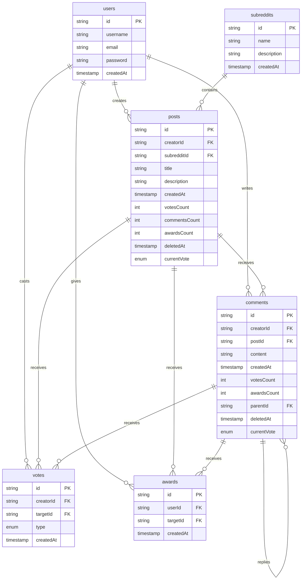

# Design The Reddit API

Design an API for Reddit subreddits given the following information.

**The API includes these 2 entities:**

- **User** | `userId`: *string*, ...
- **SubReddit** | `subredditId`: string, ...

Both of these entities likely have other fields, but for the purpose of this question, those other fields aren't needed.

Your API should support the basic functionality of a subreddit on Reddit.

Many systems design questions are intentionally left very vague and are literally given in the form of `Design Foobar`.\
It's your job to ask clarifying questions to better understand the system that you have to build.

We've laid out some of these questions below; their answers should give you some guidance on the problem.\
Before looking at them, we encourage you to take few minutes to think about what questions you'd ask in a real interview.

## Table of Content

- [Clarifying Questions](#clarifying-questions-to-ask)
- [Solution](#solution-walkthrough)

## Clarifying Questions To Ask

### Question 1

**Q:**\
*To make sure that we're on the same page: a subreddit is an online community where users can write posts, comment on posts, upvote / downvote posts, share posts, report posts, become moderators, etc. — is this correct, and are we designing all of this functionality?*

**A:**\
Yes, that's correct, but let's keep things simple and focus only on writing posts, writing comments, and upvoting / downvoting.\
You can forget about all of the auxiliary features like sharing, reporting, moderating, etc..

### Question 2

**Q:** *So we're really focusing on the very narrow but core aspect of a subreddit: writing posts, commenting on them, and voting on them.*

**A:** Yes.

### Question 3

**Q:**\
*I'm thinking of defining the schemas for the main entities that live within a subreddit and then defining their CRUD operations — methods like Create/Get/Edit/Delete/List\<Entity\> — is this in line with what you're asking me to do?*

**A:**\
Yes, and make sure to include method signatures — what each method takes in and what each method returns.\
Also include the types of each argument.

### Question 4

**Q:**\
*The entities that I've identified are Posts, Comments, and Votes (upvotes and downvotes).*\
*Does this seem accurate?*

**A:**\
Yes. These are the 3 core entities that you should be defining and whose APIs you're designing.

### Question 5

**Q:**\
*Is there any other functionality of a subreddit that we should design?*

**A:**\
Yes, you should also allow people to award posts.\
Awards are a special currency that can be bought for real money and gifted to comments and posts.\
Users can buy some quantity of awards in exchange for real money, and they can give awards to posts and comments (one award per post / comment).

## Solution Walkthrough

### 1. Gathering Requirements

As with any API design interview question, the first thing that we want to do is to gather API requirements; we need to figure out what API we're building exactly.

**From the answers we were given to our [clarifying questions](#clarifying-questions-to-ask):**

- We're designing the core user flow of the **subreddit** functionality on Reddit.
- Users can write posts on subreddits, comment on posts, and upvote/downvote posts and comments.
- We will define three primary entities: *Posts*, *Comments*, and *Votes*, along with their respective CRUD operations.
- We will also design an API for buying and giving awards on Reddit.

### 2. Coming Up With A Plan

It's important to organize ourselves and to lay out a clear plan regarding how we're going to tackle our design.\
We should identify major, potentially contentious parts of our API and justify our design decisions.

One key decision is whether to store votes directly on *Comments* and *Posts* (using *EditComment* and *EditPost*) or as separate to **Votes** entity (using *EditVote*).\
Storing them separately simplifies editing or removing votes, so we'll choose this approach.

We'll start with Posts, then move to Comments and Votes, as they share some common structure.

### 3. Posts

Posts will include an id, the id of their **creator** (`creatorId`), the id of the **subreddit** (`subredditId`) they belong to, a `title`, a `description`, and a timestamp for creation (`createdAt`).\
They will also have counts for **votes** (`votesCount`), comments, and **awards** (`awardsCount`), updated by backend services.\
Additionally, Posts will have optional **`deletedAt`** and **`currentVote`** fields for displaying deleted posts and the user's vote status, respectively.

SubReddits display posts that have been removed with a special message; we can use the **`deletedAt`** field to accomplish this.\
The **`currentVote`** field will be used to display to a user whether or not they've cast a vote on a post.\
This field will likely be populated by the backend upon fetching Posts or when casting Votes.

#### Post Fields

- `postId`: *String*
- `creatorId`: *String*
- `subredditId`: *String*
- `title`: *String*
- `description`: *String*
- `createdAt`: *Timestamp*
- `votesCount`: *Int*
- `commentsCount`: *Int*
- `awardsCount`: *Int*
- `deletedAt`: *Optional[Timestamp]*
- `currentVote`: *Optional[enum UP/DOWN]*

Our *CreatePost*, *EditPost*, *GetPost*, and *DeletePost* methods will be very straightforward.\
One thing to note, however, is that all of these operations will take in the **`userId`** of the user performing them; this id, which will likely contain authentication information, will be used for ACL (Access Control List) checks to see if the user performing the operations has the necessary permission(s) to do so.

#### CRUD Operations - Post

```haskell
CreatePost(userId: String, subredditId: String, title: String, description: string)
  => Post

EditPost(userId: String, postId: String, title: String, description: String)
  => Post

GetPost(userId: String, postId: String)
  => Post

DeletePost(userId: String, postId: String)
  => Post
```

Since we can expect to have hundreds, if not thousands, of posts on a given subreddit, our *ListPosts* method will have to be paginated.\
The method will take in optional **`pageSize`** and **`pageToken`** parameters and will return a list of posts of at most length **`pageSize`** as well as a **`NextPageToken`**—the token to be fed to the method to retrieve the next page of posts.

```haskell
ListPosts(userId: String, subredditId: String, pageSize: Optional[Int], pageToken: Optional[String])
  => (List[Post], Optional[NextPageToken])
```

### 4. Comments

Comments will be structured similarly to Posts but will also include an optional `parentId` for replies, enabling the UI to display comment trees properly.

**Key Differences from Posts:**

- Comments have a **`postId`** to indicate which post they belong to.
- They can have a **`parentId`**  to indicate if they are replying to another comment, and to allow Reddit UI to build comment trees (*indenting*).

#### Comment Fields

- `commentId`: *String*
- `creatorId`: *String*
- `postId`: *String*
- `createdAt`: *Timestamp*
- `content`: *String*
- `votesCount`: *Int*
- `awardsCount`: *Int*
- `parentId`: *Optional[String]*
- `deletedAt`: *Optional[Timestamp]*
- `currentVote`: *Optional[enum UP/DOWN]*

#### CRUD operations - Comment

```haskell
CreateComment(userId: String, postId: String, content: String, parentId: Optional[String])
  => Comment

EditComment(userId: String, commentId: String, content: String)
  => Comment

GetComment(userId: String, commentId: String)
  => Comment

DeleteComment(userId: String, commentId: String)
  => Comment

ListComments(userId: String, postId: String, pageSize: Optional[Int], pageToken: Optional[String])
  => (List[Comment], Optional[NextPageToken])
```

The *CreateComment* method includes an optional **`parentId`** parameter for replies, while *ListComments* is paginated to handle potentially large numbers of comments.

### 5. Votes

Votes will have an id, the id of their **creator** (`creatorId`), the id of their **target** (`targetId` which is **post** or **comment**), and a **`type`** (enum UP/DOWN).\
A **`createdAt`** timestamp also be included.

#### Vote Fields

- `voteId`: *String*
- `creatorId`: *String*
- `targetId`: *String*
- `type`: *enum UP/DOWN*
- `createdAt`: *Timestamp*

Since it doesn't seem like getting a single vote or listing votes would be very useful for our feature, we'll skip designing those endpoints (though they would be straightforward).

#### CRUD Operations - Vote

**Our *CreateVote*, *EditVote*, and *DeleteVote* methods will be simple and useful:**

- The *CreateVote* method will be used when a user casts a new vote on a post or comment
- The *EditVote* method will be used when a user has already cast a vote on a post or comment and casts the opposite vote on that same post or comment
- The *DeleteVote* method will be used when a user has already cast a vote on a post or comment and just removes that same vote

```haskell
CreateVote(userId: String, targetId: String, type: enum UP/DOWN)
  => Vote

EditVote(userId: String, voteId: String, type: enum UP/DOWN)
  => Vote

DeleteVote(userId: String, voteId: String)
  => Vote
```

### 6. Awards

#### CRUD Operations - Award

**We will define endpoints for **buying** and **giving** awards:**

- The *BuyAwards* endpoint will take a **`paymentToken`** and **`quantity`**
- While the *GiveAward* endpoint will take a **`targetId`** (which means to *post* or *comment* that the user will give to).

```haskell
BuyAwards(userId: String, paymentToken: String, quantity: Int)
  => Unit

GiveAward(userId: String, targetId: String)
  => Unit
```

### 7. Diagram


