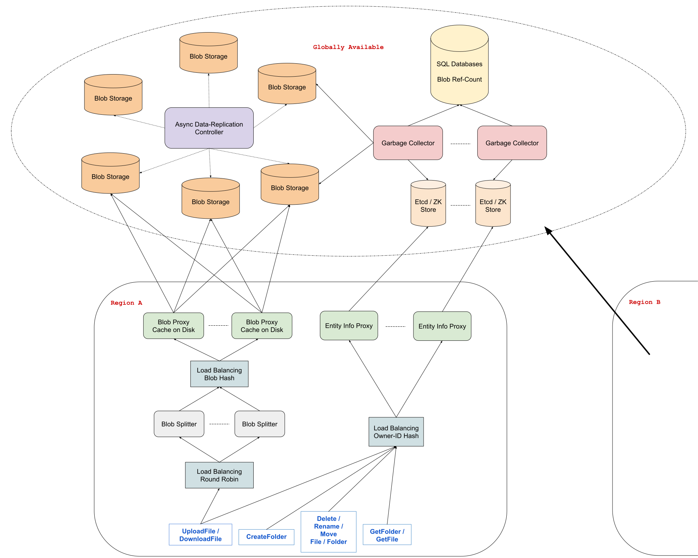

# Design Google Drive

*Many systems design questions are intentionally left very vague and are literally given in the form of `Design Foobar`.\
It's your job to ask clarifying questions to better understand the system that you have to build.*

*We've laid out some of these questions below; their answers should give you some guidance on the problem.
Before looking at them, we encourage you to take few minutes to think about what questions you'd ask in a real interview.*

## Table of Content

- [Clarifying Questions](#clarifying-questions-to-ask)
- [Solution](#solution-walkthrough)

## Clarifying Questions To Ask

### Question 1

**Q:**\
*Are we just designing the storage aspect of Google Drive, or are we also designing some of the related products like Google Docs, Sheets, Slides, Drawings, etc.?*

**A:**\
We're just designing the core Google Drive product, which is indeed the storage product.\
In other words, users can create folders and upload files, which effectively stores them in the cloud.\
Also, for simplicity, we can refer to folders and files as "entities".

### Question 2

**Q:**

- *There are a lot of features on Google Drive, like shared company drives vs. personal drives, permissions on entities (ACLs), starred files, recently-accessed files, etc.*
- *Are we designing all of these features or just some of them?*

**A:**\
Let's keep things narrow and imagine that we're designing a personal Google Drive (so you can forget about shared company drives).\
In a personal Google Drive, users can store entities, and that's all that you should take care of.\
Ignore any feature that isn't core to the storage aspect of Google Drive; ignore things like starred files, recently-accessed files, etc.\
You can even ignore sharing entities for this design.

### Question 3

**Q:**\
*Since we're primarily concerned with storing entities, are we supporting all basic CRUD operations like creating, deleting, renaming, and moving entities?*

**A:**\
Yes, but to clarify, creating a file is actually uploading a file, folders have to be created (they can't be uploaded), and we also want to support downloading files.

### Question 4

**Q:**\
*Are we just designing the Google Drive web application, or are we also designing a desktop client for Google drive?*

**A:**\
We're just designing the functionality of the Google Drive web application.

### Question 5

**Q:**\
*Since we're not dealing with sharing entities, should we handle multiple users in a single folder at the same time, or can we assume that this will never happen?*

**A:**\
While we're not designing the sharing feature, let's still handle what would happen if multiple clients were in a single folder at the same time (two tabs from the same browser, for example).\
In this case, we would want changes made in that folder to be reflected to all clients within 10 seconds.\
But for the purpose of this question, let's not worry about conflicts or anything like that (i.e., assume that two clients won't make changes to the same file or folder at the same time).

### Question 6

**Q:** *How many people are we building this system for?*

**A:** This system should serve about a billion users and handle 15GB per user on average.

### Question 7

**Q:**\
*What kind of reliability or guarantees does this Google Drive service give to its users?*

**A:**\
First and foremost, data loss isn't tolerated at all; we need to make sure that once a file is uploaded or a folder is created, it won't disappear until the user deletes it.\
As for availability, we need this system to be highly available (99.999%).

## Solution Walkthrough

### 1. Gathering System Requirements

As with any systems design interview question, the first thing that we want to do is to gather system requirements; we need to figure out what system we're building exactly.

- We're designing the core user flow of the **Google Drive** web application.
- The primary entities involved are **folders** and **files**.
- The system should enable users to **create folders**, **upload and download files**, and **rename** and **move these entities** post-storage.
- Features such as ACLs (Access Control List), sharing, and other auxiliary functionalities of Google Drive are not within the scope of this design.

- The design targets a massive scale, catering to 1 billion users, each storing an average of **15GB** of data on Google Drive.
- This equates to a total of about **15,000 PB** of data, excluding the additional metadata for each item, such as names or types.

- The system must offer **High Availability** (99.999%) and robust data redundancy.
- Ensuring no data loss even in the face of major regional disasters is a critical requirement.

### 2. Coming Up With A Plan

It's important to organize ourselves and to lay out a clear plan regarding how we're going to tackle our design.\
What are the major, distinguishable components of our how system?

**First of all, we'll need to support the following operations:**

- For **Files**
  - *UploadFile*
  - *DownloadFile*
  - *DeleteFile*
  - *RenameFile*
  - *MoveFile*
- For **Folders**
  - *CreateFolder*
  - *GetFolder*
  - *DeleteFolder*
  - *RenameFolder*
  - *MoveFolder*

**Secondly, we'll have to come up with a proper storage solution for two types of data:**

- **File Contents:** The actual file contents, which are unstructured bytes.
- **Metadata:** Information about each entity, potentially including **`entityID`, `ownerID`, `lastModified`, `entityName`, `entityType`**, among others.\
  This list is non-exhaustive, and we'll most likely add to it later on.

The next steps, we will detail the storage solutions and the processes for each operation.

### 3. Storing Entity Info

For the storage of entity data, key-value databases are our choice.\
High availability and data replication are crucial for us, necessitating the use of technologies like Etcd, Zookeeper, or Google Cloud Spanner.\
These options offer the needed consistency and reliability, unlike DynamoDB which provides only eventual consistency.

Given our scale of serving a billion users, which translates to handling vast amounts of entity data, sharding this data across multiple clusters of these K-V stores becomes essential.\
Sharding by **`entityID`** would inhibit our batch operation capabilities, which these K-V stores give us out of the box, crucial for tasks like relocating entities (e.g., moving a file across folders would require updating three entities' metadata, a cumbersome task if they reside on different shards).\
A more efficient strategy involves sharding by **`ownerID`**, enabling atomic transactions for editing multiple entities' metadata, provided they belong to the same owner.

To efficiently manage the anticipated web traffic, a layer of proxy servers dedicated to entity data will be implemented.\
These proxies, balanced via a hash of the **`ownerID`**, will not only cache data but are also designed to enforce **ACL** checks upon future integration.\
Positioned at the regional level, these proxies serve as an intermediary, while the primary key-value stores remain globally accessible.

### 4. Storing File Data

For dealing with large file uploads and storage, breaking down data into smaller chunks, or blobs, proves beneficial.\
These blobs can later be reassembled to reconstruct the original file.\
During the upload process, the files are distributed across several servers, termed **"blob splitters"**.\
These servers are tasked with dividing the files into manageable blobs and storing them in a global blob-storage system such as **GCS** or **S3**.\
Given our project aligns with **Google** Drive, opting for GCS over S3 seems more appropriate.

A critical aspect to consider is ensuring data redundancy to prevent data loss.\
A feasible approach involves attempting to store the data across 3 distinct GCS **buckets**, considering the operation successful if the data is successfully written to at least 2 of these buckets.\
This strategy ensures data redundancy while maintaining availability.\
In the background, we can have an extra service in charge of further replicating the data to other buckets in an async manner.\
We'll want to select these 3 buckets across different availability zones to safeguard against data loss due to natural disasters or significant power failures.

To prevent the storage of duplicate blobs, we can employ a naming convention based on the content's hash.\
This method known as **[Content-Addressable Storage](https://en.wikipedia.org/wiki/Content-addressable_storage)**, ensures that all stored blobs are immutable.\
So, any modification to a file results in the creation and storage of new blobs, under the new names computed by hashing of their updated content.

This approach to immutability significantly simplifies the introduction of a caching layer between the *blob splitters* and the storage buckets.\
It eliminates concerns about cache coherence with the main source of truth, as any modification generates a completely different blob.

### 5. Entity Info Structure

Since folders and files will both have common bits of metadata, we can have them share the same structure.\
The difference will be that folders will have an **`is_folder`** flag set to `true` and a list of **`children_ids`**, which will point to the entity information for the folders and files within the folder in question.\
Files will have an **`is_folder`** flag set to `false` and a **`blobs`** field, which will have the IDs of all of the blobs that make up the data within the relevant file.\
Both entities can also have a **`parent_id`** field, which will point to the entity information of the entity's parent folder.\
This will help us quickly find parents when moving files and folders.

- **File Info**

    ```txt
    {
      blobs: ['«blob_content_hash_0»', '«blob_content_hash_1»'],
      id: '«some_unique_entity_id»',
      is_folder: false,
      name: '«some_file_name»',
      owner_id: '«id_of_owner»',
      parent_id: '«id_of_parent»',
    }
    ```

- **Folder Info**

    ```txt
    {
      children_ids: ['«id_of_child_0»', '«id_of_child_1»'],
      id: '«some_unique_entity_id»',
      is_folder: true,
      name: '«some_folder_name»',
      owner_id: '«id_of_owner»',
      parent_id: '«id_of_parent»',
    }
    ```

### 6. Garbage Collection

Any change to an existing file will create a whole new blob and de-reference the old one.\
Furthermore, any deleted file will also de-reference the file's blobs.\
This means that we'll eventually end up with a lot of **orphaned** blobs that are basically unused and taking up storage for no reason.\
We'll need a way to get rid of these blobs to free some space.

We can have a **Garbage Collection** service that watches the entity-info K-V stores and keeps counts of the number of times every blob is referenced by files; these counts can be stored in a SQL table.

Reference counts will get updated whenever files are uploaded and deleted.\
When the reference count for a particular blob reaches 0, the *Garbage Collector* can mark the blob in question as orphaned in the relevant blob stores, and the blob will be safely deleted after some time if it hasn't been accessed.

### 7. End To End API Flow

Now that we've designed the entire system, we can walk through what happens when a user performs any of the operations we listed above.

*CreateFolder* is simple; since folders don't have a blob-storage component, creating a folder just involves storing some metadata in our key-value stores.

*UploadFile* works in two steps.\
The first is to store the blobs that make up the file in the blob storage.\
Once the blobs are persisted, we can create the file-info object, store the blob-content hashes inside its **blobs** field, and write this metadata to our key-value stores.

*DownloadFile* fetches the file's metadata from our key-value stores given the file's ID.\
The metadata contains the hashes of all of the blobs that make up the content of the file, which we can use to fetch all of the blobs from blob storage.\
We can then assemble them into the file and save it onto local disk.

All of the *Get*, *Rename*, *Move*, and *Delete* operations atomically change the metadata of one or several entities within our key-value stores using the **transaction** guarantees that they give us.

### 8. System Diagram


