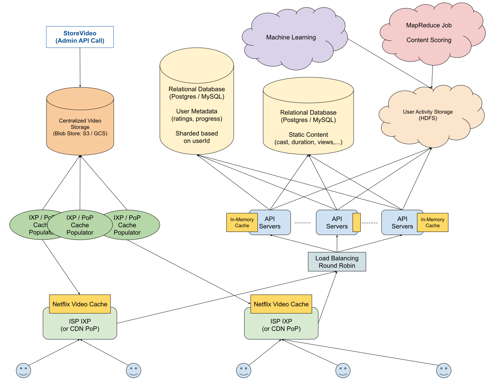

# Design Netflix

*Many systems design questions are intentionally left very vague and are literally given in the form of `Design Foobar`.\
It's your job to ask clarifying questions to better understand the system that you have to build.*

*We've laid out some of these questions below; their answers should give you some guidance on the problem.\
Before looking at them, we encourage you to take few minutes to think about what questions you'd ask in a real interview.*

## Table of Content

- [Clarifying Questions](#clarifying-questions-to-ask)
- [Solution](#solution-walkthrough)

## Clarifying Questions To Ask

### Question 1

**Q:**

- *From a high-level point of view, Netflix is a fairly straightforward service: users go on the platform, they're served movies and shows, and they watch them.*
- *Are we designing this high-level system entirely, or would you like me to focus on a particular subsystem, like the Netflix home page?*

**A:**\
We're just designing the core Netflix product—so the overarching system / product that you described.

### Question 2

**Q:**\
*Should we worry about auxiliary services like authentication and payments?*

**A:**\
You can ignore those auxiliary services; focus on the primary user flow.\
That being said, one thing to note is that, by nature of the product, we're going to have access to a lot of user-activity data that's going to need to be processed in order to enable Netflix's recommendation system.\
You'll need to come up with a way to aggregate and process user-activity data on the website.

### Question 3

**Q:**\
*For this recommendation system, should I think about the kind of algorithm that'll fuel it?*

**A:**\
No, you don't need to worry about implementing any algorithm or formula for the recommendation engine.\
You just need to think about how user-activity data will be gathered and processed.

### Question 4

**Q:**

- *It sounds like there are 2 main points of focus in this system: the **video-serving** service and the **recommendation engine**.*
- *Regarding the video-serving service, I'm assuming that we're looking for high availability and fast latencies globally; is this correct?*

**A:**\
Yes, but just to clarify, the video-streaming service is actually the only part of the system for which we care about fast latencies.

### Question 5

**Q:** *So is the recommendation engine a system that consumes the user-activity data you mentioned and operates asynchronously in the background?*

**A:** Yes.

### Question 6

**Q:** *How many users do we expect to be building this for?*

**A:** Netflix has about 100M to 200M users, so let's go with 200M.

### Question 7

**Q:**\
*Should we worry about designing this for various clients, like desktop clients, mobile clients, etc.?*

**A:**\
Even though we're indeed designing Netflix to be used by all sorts of clients, let's focus purely on the distributed-system component—so no need to get into details about clients or to optimize for certain clients.

## Solution Walkthrough

### 1. Gathering System Requirements

As with any systems design interview question, the first thing that we want to do is to gather system requirements; we need to figure out what system we're building exactly.

We're designing the core Netflix service, which allows users to stream movies and shows from the Netflix website.

**Specifically, we'll want to focus on:**

- Delivering large amounts of high-definition video content to hundreds of millions of users around the globe without too much buffering.
- Processing large amounts of user-activity data to support Netflix's recommendation engine.

### 2. Coming Up With A Plan

**We'll tackle this system by dividing it into four main sections:**

- Storage (Video Content, Static Content, and User Metadata)
- General Client-Server Interaction (i.e., the life of a query)
- Video Content Delivery
- User-Activity Data Processing

### 3. Video-Content Storage

Since Netflix's service, which caters to millions of customers, is centered around video content, we might need *a lot* of storage space and a complex storage solution.\
Let's start by estimating how much space we'll need.

We were told that Netflix has about 200 million users; we can make a few assumptions about other Netflix metrics (alternatively, we can ask our interviewer for guidance here):

- Netflix offers roughly 10 thousand movies and shows at any given time
- Since movies can be up to 2+ hours in length and shows tend to be between 20 and 40 minutes per episode, we can assume an average video length of 1 hour
- Each movie / show will have a **Standard Definition** version and a **High Definition** version.\
  Per hour, SD will take up about 10GB of space, while HD will take about 20GB.

$$
\begin{aligned}
  &\sim 10\text{K videos (stored in SD \\& HD)}\\
  &\sim1\text{ hour average video length}\\
  &\sim10\text{ GB/h for SD} + \sim20\text {GB/h for HD} = 30\text{ GB/h per video}\\
  &\sim30\text{ GB/h} \times 10\text{K videos} = 300,000\text{ GB} = 300\text{ TB}
\end{aligned}
$$

> See storage estimation in the [cheat sheet](/05_storage/README.md#storage-scale-cheat-sheet)

This number highlights the importance of estimations.\
Naively, one might think that Netflix stores many petabytes of video, since its core product revolves around video content; but a simple back-of-the-napkin estimation shows us that it actually stores a very modest amount of video.

This is because Netflix, unlike other services like YouTube, Google Drive, and Facebook, has a bounded amount of video content: the movies and shows that it offers; those other services allow users to upload unlimited amounts of video.

Since we're only dealing with a few hundred terabytes of data, we can use a simple blob storage solution like **S3** or **GCS** to reliably handle the storage and replication of Netflix's video content; we don't need a more complex data-storage solution.

### 4. Static-Content Storage

Apart from video content, we'll want to store various pieces of static content for Netflix's movies and shows, including video titles, descriptions, and cast lists.

This content will be bounded in size by the size of the video content, since it'll be tied to the number of movies and shows, just like the video content, and since it'll naturally take up less space than the video data.

We can easily store all of this static content in a relational database or even in a document store, and we can cache most of it in our API servers.

### 5. User Metadata Storage

We can expect to store some user metadata for each video on the Netflix platform.\
For instance, we might want to store the timestamp that a user left a video at, a user's rating on a video, etc..

Just like the static content mentioned above, this user metadata will be tied to the number of videos on Netflix.\
However, unlike the static content, this user metadata will grow with the Netflix user-based, since each user will have user metadata.

**We can quickly estimate how much space we'll need for this user metadata:**

$$
\begin{aligned}
  \sim&200\text{M users}\\
  \sim&1\text{K videos watched per user per lifetime}\ (\sim10\\%\text{ of total content})\\
  \sim&100\text{ bytes/video/user}\\
  \sim&100\text{ bytes} \times 1\text{K videos} \times 200\text{M users} = 100\text{ KB} \times 200\text{M} = 1\text{ GB} \times 20\text{K} = 20\text{ TB}
\end{aligned}
$$

Perhaps surprisingly, we'll be storing an amount of user metadata in the same ballpark as the amount of video content that we'll be storing.\
Once again, this is because of the bounded nature of Netflix's video content, which is in stark contrast with the unbounded nature of its user-based.

We'll likely need to query this metadata, so storing it in a classic relational database like **Postgres** makes sense.

Since Netflix users are effectively isolated from one another (they aren't connected like they would be on a social-media platform, for example), we can expect all of our latency-sensitive database operations to only relate to individual users.\
In other words, potential operations like *GetUserInfo* and *GetUserWatchedVideos*, which would require fast latencies, are specific to a particular users; on the other hand, complicated database operations involving multiple users' metadata will likely be part of background data-engineering jobs that don't care about latency.

Given this, we can split our user-metadata database into a handful of shards, each managing anywhere between 1 and 10 TB of indexed data.\
This will maintain very quick reads and writes for a given user.

### 6. General Client-Server Interaction

The part of the system that handles serving user metadata and static content to users shouldn't be too complicated.

We can use some simple round-robin load balancing to distribute end-user network requests across our API servers, which can then load-balance database requests according to userId (since our database will be sharded based on userId).

As mentioned above, we can cache our static content in our API servers, periodically updating it when new movies and shows are released, and we can even cache user metadata there, using a write-through caching mechanism.

### 7. Video Content Delivery

We need to figure out how we'll be delivering Netflix's video content across the globe with little latency.\
To start, we'll estimate the maximum amount of bandwidth consumption that we could expect at any point in time.\
We'll assume that, at peak traffic, like when a popular movie comes out, a fairly large number of Netflix users might be streaming video content concurrently.

$$
\begin{aligned}
  \sim&200\text{M total users}\\
  \sim&5\\%\text{ of total users streaming concurrently during peak hours}\\
  \sim&20\text{ GB/h of HD video} \simeq 5 \text{MB/s of HD video}\\
  \sim&5\\%\text{ of }200\text{M} \times 5\text{ MB/s} = 10\text{M} \times 5\text{ MB/s} = 50\text{ TB/s}
\end{aligned}
$$

This level of bandwidth consumption means we can't just naively serve the video content out of a single data center or even dozens of data centers.\
We need many thousands of locations around the world to be distributing this content for us.\
Thankfully, **CDN**s solve this precise problem, since they have many thousands of **Points of Presence** around the world.\
We can thus use a CDN like **Cloudflare** and serve our video content out of the CDN's PoPs.

Since the **PoPs** can't keep the entirety of Netflix's video content in cache, we can have an external service that periodically repopulates *CDN PoPs* with the most important content (the movies and shows most likely to be watched).

### 8. User-Activity Data Processing

We need to figure out how we'll process vast amounts of user-activity data to feed into Netflix's recommendation engine.\
We can imagine that this user-activity data will be gathered in the form of logs that are generated by all sorts of user actions; we can expect terabytes of these logs to be generated every day.

**MapReduce** can help us here.\
We can store the logs in a distributed file system like **HDFS** and run *MapReduce* jobs to process massive amounts of data in parallel.\
The results of these jobs can then be fed into some machine learning pipelines or simply stored in a database.

### 9. System Diagram

