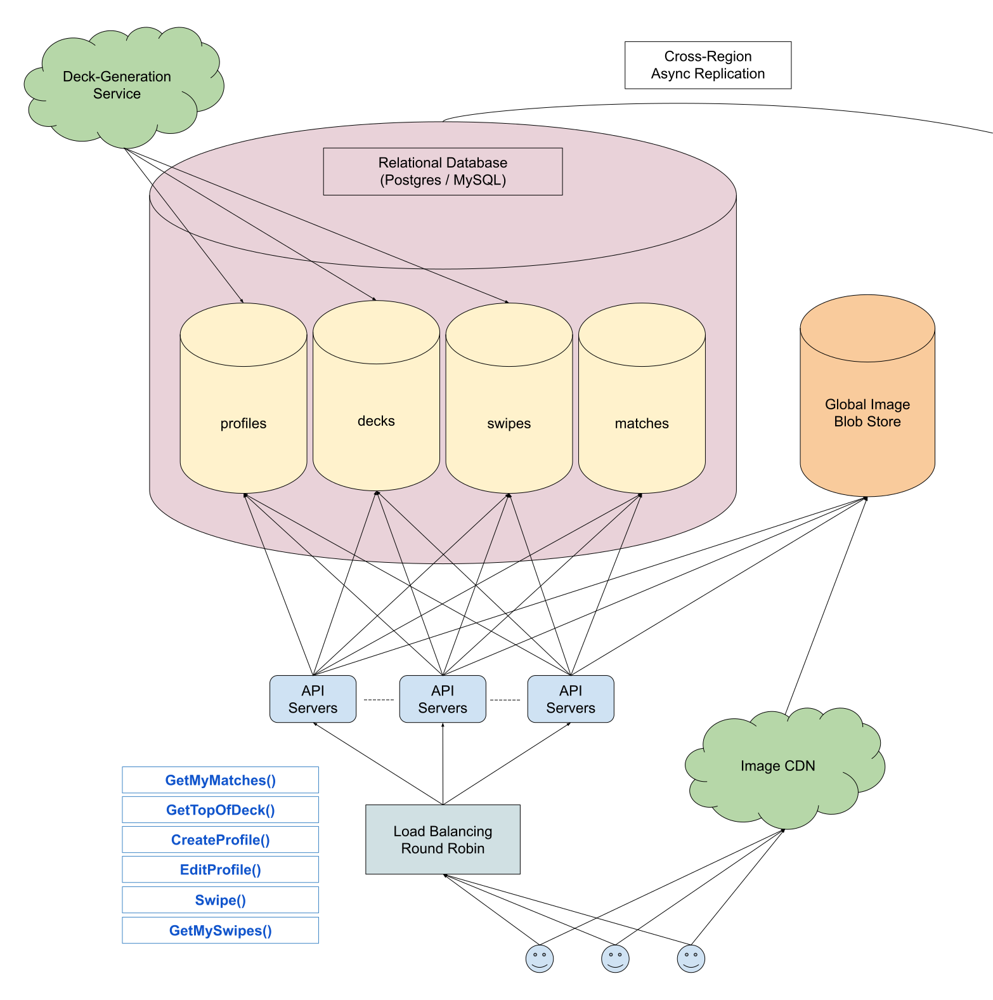

# Design Tinder

*Many systems design questions are intentionally left very vague and are literally given in the form of `Design Foobar`.\
It's your job to ask clarifying questions to better understand the system that you have to build.*

*We've laid out some of these questions below; their answers should give you some guidance on the problem.\
Before looking at them, we encourage you to take few minutes to think about what questions you'd ask in a real interview.

## Table of Content

- [Clarifying Questions](#clarifying-questions-to-ask)
- [Solution](#solution-walkthrough)

## Clarifying Questions To Ask

### Question 1

**Q:**

- *As far as I know, users who sign up on Tinder first create a profile (name, age, job, bio, sexual preference, etc.).*
- *After which they can start swiping on other users near them, who appear in a stacked deck of potential matches on the main page of the app.*
- *If two users swipe right on each other, they match, and they can now directly communicate with one another.*
- *Are we designing all of this?*

**A:**\
Yes, but you don't have to design the messaging feature or any functionality that's available after two users match.\
You should also design both the Super Like feature and the Undo feature.

- *Super Like* allows a user to effectively arrive at the top of another user's deck, indicating that they super-liked them.
- *Undo* allows a user to unswipe the last user that they swiped on.

So if they accidentally swiped left on someone, they can undo that.\
But this can only be done for the **last user**; you can't spam undo.

### Question 2

**Q:**\
*Regarding the Undo feature, can a user undo a match?*

**A:**\
For the sake of this design, let's only allow undoing when you swipe left—not when you swipe right.\
And if you swipe left, then swipe right, you can no longer undo the left swipe from two swipes ago.

### Question 3

**Q:**

- *Do users have a limited number of right swipes, Super Likes, and Undos per day?*
- *What about the number of potential matches in their deck?*
- *Is there a daily cap on that number, like 100 or 200 potential matches per day?*

**A:**\
For the sake of this design, let's not have any caps whatsoever.\
In other words, users will be given an infinite amount of potential matches in their deck (within their distance parameters), and they can endlessly swipe right on them, Super Like them, and undo left swipes.\
Naturally, if a user were to swipe through every single potential match within their distance parameters, then they would run out of potential matches, but their deck would likely quickly get new potential matches as new users sign up on Tinder.

#### Question 4

**Q:**

*Regarding the deck of potential matches, here are some assumptions that I'm making; let me know if this sounds appropriate.*

- *Every user has an endless deck of potential matches that are within their distance parameters, as we just mentioned, and this deck should be ordered in some way (perhaps based on a matchability score).*
- *The deck should only consist of users who have either already liked this user or not yet swiped on them.*
- *For users who have already swiped left on the main user, we should probably, in a best-effort type of way, try to remove them from the main user's deck.*
- *And then, of course, users who have super-liked the main user should be at the top of the deck.*
*Does this seem reasonable?*

**A:**\
This seems reasonable, but you don't actually need to worry about how decks are generated.\
In other words, you can assume that we have a smart matching algorithm that generates the decks for you based on matchability scores, preferences, distance, etc., and you should just rely on this algorithm and figure out where it fits into your design.\
So you don't even need to worry about whether potential matches who've swiped left on a user show up in the user's deck; the matching algorithm will take care of that for you.

### Question 5

**Q:** *Are we designing the part of the system that notifies users when they have a new match?*

**A:**\
You should think about how a user will be notified of a match if a match occurs in real time, as they swipe right on another user.\
Otherwise, don't worry about the match-notification system when the user is idle on the app or not using the app at all.

### Question 6

**Q:**\
*As far as scale is concerned, how many users are we designing Tinder for, and where in the world should we assume that they're located?*

**A:**\
Let's assume that we have roughly 50 million users on Tinder.\
You can assume that they're evenly distributed across the globe, perhaps with hot spots in major urban areas.

### Question 7

**Q:**

- *As far as latency and reliability are concerned, I'm assuming that we want Tinder to be mostly highly available and that we want swipes to feel instant.*
- *Is it ok if there's a little bit of loading time when you first open the app or after you've swiped through, say, 200 profiles?*

**A:**\
What you described for latency is great.\
As far as reliability is concerned, let's not worry too much about it for the sake of this design.\
You can assume that you have a highly available SQL setup out of the box, without worrying about the availability details.

## Solution Walkthrough

### 1. Gathering System Requirements

As with any systems design interview question, the first thing that we want to do is to gather system requirements; we need to figure out what system we're building exactly.

- We're designing the core system behind Tinder, which allows users to create a profile and swipe through a seemingly endless deck of potential matches.
- Users can also super-like potential matches, putting themselves at the top of the other users' decks, and they can undo their most recent swipe if it was a left swipe.
- Users don't have any limitations on the number of swipes, Super Likes, and Undos that they can do per day.

- We're explicitly not designing any functionality that's available after two users match, including any kind of notification system to alert users that they've gotten a match, unless the match occurs directly when they swipe right on a potential match.

- Our system should serve a global user base of about 50 million users who are evenly distributed across the world, and we'd like to have mostly instant swipes, allowing for some latency when the Tinder app first loads up and after a user has swiped through a good number of potential matches.

We're told not to focus on the availability of our system, which should help us narrow down our design a little bit.

### 2. Coming Up With A Plan

**We'll tackle this system by dividing it into four main sections:**

- Storage Overview
- Profile Creation
- Deck Generation
- Swiping

We'll cover super-liking and undoing at the end, which will likely involve making tweaks to our design for swiping.

### 3. Storage Overview

Most of the data that we expect to store (profiles, decks, swipes, and matches), makes sense to be structured, so we'll use a SQL storage solution for it, and it'll be served directly from relevant SQL tables.

All of this data will be stored in regional databases, located based on user hot spots (e.g., a database on the east coast of the U.S., one in central U.S., one in western Europe, one in India, etc.), and users fetching Tinder data will be automatically routed to the closest regional database after being routed to intermediary API servers via some round-robin load balancing.

The only exception is users' profile pictures, which we'll store in a global blob store and which will be served via CDN.

We'll have some asynchronous replication between the regional databases, which should take anywhere from a few minutes to a few hours to occur.\
The asynchronicity of the replication should be fine, because the people that users interact with will usually, by the nature of the app, be close to them and therefore be using the same regional database as them.

### 4. Profile Creation

**We'll store Tinder profiles in an individual SQL table, where each row will represent a profile:**

- `userId`: *string*, the unique id of the user
- `geoLocation`: *point*
- `name`: *string*
- `age`: *int*
- `gender`: *enum*
- `sexualPreference`: *enum*
- `job`: *string*
- `bio`: *string*
- `pictures`: *string\[\]*, a list of blob-store addresses

The *`userId`* field will be automatically assigned to the user, while most of the other fields will be set by the user when creating or editing their profile.\
The user's `geoLocation` can be updated any time that the user opens the Tinder app and is in a different location than the one stored in their profile.

With 50 million users and an estimated upper bound of ~2KB per profile (pictures excluded), we'll need 2KB * 50e6 = 100GB of storage per region, or 1-5TB in total, assuming 10-50 regional databases.\
This is very little storage space.

As far as pictures are concerned, we can assume that users will have an average of five pictures each, with an upper bound of ~2MB per picture (high-quality, 1920×1080p).\
We'll almost certainly want to reduce the dimensions of pictures, since they'll only be viewable on small mobile screens, and we'll perform some lossy compression on them, because we can afford to lose a bit of quality.\
We can assume that this will bring pictures down to roughly ~50KB per picture (~200-500KB after dimension reduction and ~50KB after lossy compression).

$$
\begin{aligned}
  \sim50\text{KB}\times 5 =& 250\text{KB of pictures per user}\\
  \sim250\text{KB}\times 50\mathrm{e}6\text{ users} =& 12.5\text{TB (not a lot)}
\end{aligned}
$$

Clearly, the pictures account for most of our storage needs.

### 5. Deck Generation

For deck generation, we're going to have our smart deck-generation algorithm continuously generate decks of 200 potential matches for each user every day.\
This will ensure that user decks are as relevant as possible when users interact with them.\
For example, if someone is traveling out of a location and therefore no longer relevant to a particular user, they'll be removed from the user's deck within a day, minimizing the chance for a user to see irrelevant profiles.

The deck-generation algorithm can be smart enough not to re-generate decks for users who are inactive for more than a day, and it can also be told to re-generate decks for users who've just changed location (i.e., when a user opens the Tinder app and is in a different location than the one stored in their profile row, the app tells the deck-generation algorithm to re-generate a deck for the user).

**We'll store each user's deck of potential matches in an individual SQL table, where each row will represent a deck:**

- `userId`: *string*, the id of the user that this deck belongs to
- `potentialMatches`: *string\[\]*, a list of userIds

On app load, the Tinder app will request the 40 profiles at the top of their deck, remove them from the top of their deck (i.e., by updating their deck's row in the decks table), and locally store them.\
It's worth noting that, had we not compressed the profile images at the time of profile creation, each user would be requesting and attempting to store 400MB of data, which would be way too much data.\
With our compression, where each picture is ~50KB, 40 profiles becomes just 10MB of data, which is acceptable.

It's also worth noting that, if the user shuts their phone down or completely closes the Tinder app process, any locally stored profiles that the user hadn't swiped on will simply be read to their deck at a later time by the deck-generation algorithm, since they were presumably relevant profiles and haven't yet been swiped on by the user.

The Tinder app will ensure that the number of locally cached profiles never goes below 20, such that the user almost never feels like they've run out of profiles to swipe on, even for a few seconds.\
To accomplish this, the user's phone will eagerly fetch 20 additional profiles from the top of their deck when the user has 20 locally stored profiles left.

When the user runs out of potential matches (i.e., their deck has gone from 200 to 0 potential matches), the request for 20 more profiles triggers a new deck to be generated on demand.\
This is the only time that we might expect some potential loading time in the middle of using the app, but this happens infrequently, since the user would have to swipe on 200 potential matches within a day and would have to be swiping right extremely fast to go through their final 20 profiles before a new deck is generated.

### 6. Swiping

**For swiping, we'll have two more SQL tables: one for swipes and one for matches.
The SQL table for swipes will look like this:**

- `swiperId`: *string*, the id of the user that performed the swipe
- `swipeeId`: *string*, the id of the user that was swiped on
- `swipeType`: *enum* (**`LIKE`**, **`PASS`**)
- `timestamp`: *datetime*

This table will be indexed on *`swipeeId`* and *`timestamp`* in order to allow for fast lookups of a user's recent swipes (all of the recent swipes that were performed ***on*** the user).

**The SQL table for matches will look like this:**

- `userOneId`: *string*, the id of the first user in the match
- `userTwoId`: *string*, the id of the second user in the match
- `timestamp`: *datetime*

This matches table will mainly be used for the part of the system that is beyond the scope of this question.

On app load, the Tinder app will fetch all of the rows in the swipes table where *`swipeeId`* matches the user's *`userId`*.\
Then, every 30 seconds, it'll fetch the same rows, except only those with a timestamp after the most recent previously-fetched swipe's timestamp.

The Tinder app will keep all of the swipes in memory, in a hashtable-like structure, meaning that for any potential match, the app can know right away if they've already swiped on the user.\
This data can easily fit in memory on a phone (~20 bytes per swipe * maximum of 100k swipes = 2MB).

When a user swipes, the app will write the swipe to the swipes table.\
If the swipe is a **LIKE**, the backend will check for a matching swipe, and if there is one, it'll write a match to the matches table.

On the app's side, if there's a match (instantly knowable because of the local cache of swipes), the app will display a notification to the user; this is instant because we don't rely on the backend's response.

### 7. Super-Liking

**The Super Like feature can be implemented with the following tweaks to our existing system:**

1. A new **SUPER-LIKE** value is added to the *`swipeType`* in the swipes table.
2. When a user (**Foo**) super-likes a potential match (**Bar**), the recorded swipe gets set to a **SUPER-LIKE**.
   If the backend notices a match, nothing else happens, except for writing the match to the matches table.\
   Otherwise, the backend writes **Foo**'s *`userId`* to **Bar**'s deck row in the decks table, putting **Foo** at the top of **Bar**'s deck, behind other super-likes, because older super-likes have precedence.\
   If **Foo**'s *`userId`* was already in **Bar**'s deck, it simply gets moved.

Our deck-generation algorithm is smart enough to keep super-likes at the top of decks, ordered by timestamp, such that older super-likes appear first.

As far as the Tinder UI is concerned, when the potential match at the top of a user's deck has super-liked the user (instantly knowable because of the local cache of swipes), a visual indicator is displayed.\
If a user gets super-liked while on the app by a user whose profile hasn't yet been fetched (i.e., a user who isn't in the 20-40 locally stored profiles), as soon as the app fetches the next 20 profiles from their deck, they'll see the Super Like at the top.

### 8. Undoing

The Undo feature can be implemented by simply delaying the API calls that occur on a left swipe until the next swipe or until the Tinder app is closed.
This avoids doing multiple writes to the swipes table, which would otherwise be required in order to undo a left swipe.

### 9. System Diagram

